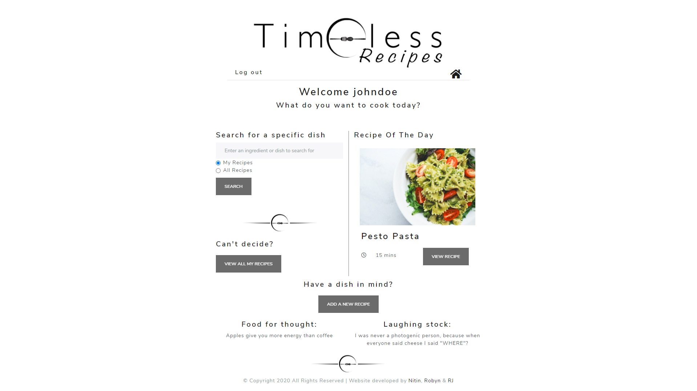

# Timeless Recipes

## Description
### Your favourite helper in the kitchen - Timeless Recipes! 

Store your favourite recipes digitally, protected from wear and tear around the kitchen. Search through your recipe efficiently, by name or ingredient. Find inspiration from other users by browsing their recipes you struggle to think of "What's for dinner?". 

Find the application live on Heroku [here](https://fast-reaches-40282.herokuapp.com/).

## Table of Contents
* [Installation](#installation)
* [Usage](#usage)
* [Tests](#tests)
* [Technologies](#technologies)
* [Contributing](#contributing)
* [License](#license)
* [Questions](#questions)

## Installation
To use this application locally, be sure to have NODE.js and MySQL installed on your local machine. Clone the files. Open the directory and run `npm install` to install dependencies. You will require API keys for Spoonacular, and to add these keys a .env file in main directory, along with your MySQL user/database information. 

Alternatively, you can use this application through [Heroku](https://fast-reaches-40282.herokuapp.com/).

## Usage

Create an account with Timeless Recipe and explore the possibilities:

* Add your own recipes.
* View, edit and delete your recipes.
* View the recommended recipe of the day.
* Search all your recipes by title or ingredient.
* Search all recipes in Timeless Recipes by title or ingredient.
* Enjoy food jokes and trivia. 

## Tests
No testing has been implemented for this application. 

## Technologies
* NODE.js, Express, MySQL, Sequelize & Passport
* Handlebars
* jQuery and Bootstrap
* Travis
* Spoonacular API
* AWS
* Multer
* dotenv
* Adobe XD for wireframing & prototyping

## Contributing
Contributions are welcome. Feel free to fork the project and create a pull request with your changes - be sure to document your code clearly. 
## License
This project is licensed under the terms of the ISC license. Read more about this license [here](https://opensource.org/licenses/ISC).
## Questions
This project was created by [robynheslop](https://github.com/robynheslop), [nitinmuk](https://github.com/https://github.com/nitinmuk) and [arjae.sj](https://github.com/arjaesj). If you have further questions about this project, please contact us at [timeless.recipes2@gmail.com](timeless.recipes2@gmail.com).

